# Architecture / Codebase map

Back to docs index: [`README.md`](README.md) • Back to landing page: [`../README.md`](../README.md)

This document is a **mental map** of how the repository is connected:

- **Pipeline view**: how data flows through the end-to-end commands
- **Dependency view**: which top-level Python modules depend on which others
- **Responsibilities**: what each key file is “for”

If you’re looking for exact CLI behaviors and edge cases, see [`PIPELINE_REFERENCE.md`](PIPELINE_REFERENCE.md).

## Key entrypoints

- **Unified CLI**: `wahlomat.py`
  - Routes to download/build/update/graphs subcommands.
- **Download and extract**: `get_zip_files.py`
  - Downloads archived Wahl-O-Mat ZIPs and/or the bpb “Datensätze” bundle; extracts into `data/`.
- **Build the combined CSV**: `build_dataframe.py`
  - Parses extracted JS exports and/or Excel bundle sheets into `all_wahlomat_answers.csv` and then rebuilds `election_metadata.csv`.
- **Update CSV from Excel only**: `update_excel_csv.py`
  - Replaces/merges only the workbook-derived election blocks inside `all_wahlomat_answers.csv`, then rebuilds metadata.
- **Generate graphs from CSV**: `build_graphs_from_csv.py`
  - Reads `all_wahlomat_answers.csv` and calls into `analysis.py` to write PNG plots to `graphs/`.

## Pipeline view (data flow)

```mermaid
flowchart TD
  user[You] --> wahlomat[wahlomat.py]

  wahlomat -->|"download"| getZip[get_zip_files.py]
  getZip --> dataDir[data/]

  wahlomat -->|"build-csv"| buildDf[build_dataframe.py]
  dataDir --> buildDf
  buildDf --> answers[all_wahlomat_answers.csv]
  buildDf --> meta[election_metadata.csv]

  wahlomat -->|"update-csv"| updateCsv[update_excel_csv.py]
  dataDir --> updateCsv
  answers --> updateCsv
  updateCsv --> answers
  updateCsv --> meta

  wahlomat -->|"graphs"| graphs[build_graphs_from_csv.py]
  answers --> graphs
  graphs --> outGraphs[graphs/ (PNGs)]
```

## Dependency view (modules)

The graph below is **auto-generated** from the repository’s Python import relationships (top-level `.py` modules). It’s meant to answer “if I touch file X, what else might be affected?”.

```mermaid
flowchart LR
  m_analysis["analysis.py"]
  m_bpb_urls["bpb_urls.py"]
  m_build_dataframe["build_dataframe.py"]
  m_build_graphs_from_csv["build_graphs_from_csv.py"]
  m_build_metadata["build_metadata.py"]
  m_election_id_policy["election_id_policy.py"]
  m_failed_analysis["failed_analysis.py"]
  m_get_zip_files["get_zip_files.py"]
  m_graph_kinds["graph_kinds.py"]
  m_load_modules["load_modules.py"]
  m_skipped_elections["skipped_elections.py"]
  m_update_excel_csv["update_excel_csv.py"]
  m_wahlomat["wahlomat.py"]
  m_wahlomat_extended_analysis_analysis["wahlomat_extended_analysis/analysis.py"]
  m_wahlomat_extended_analysis_bpb_urls["wahlomat_extended_analysis/bpb_urls.py"]
  m_wahlomat_extended_analysis_build_dataframe["wahlomat_extended_analysis/build_dataframe.py"]
  m_wahlomat_extended_analysis_build_graphs_from_csv["wahlomat_extended_analysis/build_graphs_from_csv.py"]
  m_wahlomat_extended_analysis_build_metadata["wahlomat_extended_analysis/build_metadata.py"]
  m_wahlomat_extended_analysis_election_id_policy["wahlomat_extended_analysis/election_id_policy.py"]
  m_wahlomat_extended_analysis_get_zip_files["wahlomat_extended_analysis/get_zip_files.py"]
  m_wahlomat_extended_analysis_graph_kinds["wahlomat_extended_analysis/graph_kinds.py"]
  m_wahlomat_extended_analysis_repo_paths["wahlomat_extended_analysis/repo_paths.py"]
  m_wahlomat_extended_analysis_skipped_elections["wahlomat_extended_analysis/skipped_elections.py"]
  m_wahlomat_extended_analysis_update_excel_csv["wahlomat_extended_analysis/update_excel_csv.py"]
  m_analysis --> m_wahlomat_extended_analysis_graph_kinds
  m_bpb_urls --> m_wahlomat_extended_analysis_bpb_urls
  m_build_dataframe --> m_wahlomat_extended_analysis_analysis
  m_build_dataframe --> m_wahlomat_extended_analysis_election_id_policy
  m_build_dataframe --> m_wahlomat_extended_analysis_skipped_elections
  m_build_graphs_from_csv --> m_wahlomat_extended_analysis_build_graphs_from_csv
  m_election_id_policy --> m_wahlomat_extended_analysis_election_id_policy
  m_failed_analysis --> m_wahlomat_extended_analysis_analysis
  m_failed_analysis --> m_wahlomat_extended_analysis_skipped_elections
  m_graph_kinds --> m_wahlomat_extended_analysis_graph_kinds
  m_load_modules --> m_wahlomat_extended_analysis_analysis
  m_skipped_elections --> m_wahlomat_extended_analysis_skipped_elections
  m_update_excel_csv --> m_wahlomat_extended_analysis_analysis
  m_update_excel_csv --> m_wahlomat_extended_analysis_build_dataframe
  m_update_excel_csv --> m_wahlomat_extended_analysis_build_metadata
  m_wahlomat_extended_analysis_analysis --> m_analysis
  m_wahlomat_extended_analysis_build_dataframe --> m_build_dataframe
  m_wahlomat_extended_analysis_build_graphs_from_csv --> m_wahlomat_extended_analysis_analysis
  m_wahlomat_extended_analysis_build_graphs_from_csv --> m_wahlomat_extended_analysis_graph_kinds
  m_wahlomat_extended_analysis_build_metadata --> m_wahlomat_extended_analysis_analysis
  m_wahlomat_extended_analysis_build_metadata --> m_wahlomat_extended_analysis_bpb_urls
  m_wahlomat_extended_analysis_build_metadata --> m_wahlomat_extended_analysis_election_id_policy
  m_wahlomat_extended_analysis_build_metadata --> m_wahlomat_extended_analysis_get_zip_files
  m_wahlomat_extended_analysis_get_zip_files --> m_wahlomat_extended_analysis_analysis
  m_wahlomat_extended_analysis_get_zip_files --> m_wahlomat_extended_analysis_bpb_urls
  m_wahlomat_extended_analysis_get_zip_files --> m_wahlomat_extended_analysis_build_metadata
  m_wahlomat_extended_analysis_get_zip_files --> m_wahlomat_extended_analysis_election_id_policy
  m_wahlomat_extended_analysis_update_excel_csv --> m_update_excel_csv
```

<!-- AUTOGEN:ARCHITECTURE_DEPS:START -->
<!-- This block is generated by tools/gen_architecture.py. Do not edit by hand. -->

<!-- AUTOGEN:ARCHITECTURE_DEPS:END -->

## File responsibilities (quick reference)

### `wahlomat.py`

Unified CLI entry point. Dispatches to:

- download/extract (`get_zip_files.py`)
- build CSV (`build_dataframe.py`)
- update CSV from Excel (`update_excel_csv.py`)
- graphs from CSV (`build_graphs_from_csv.py`)

### `get_zip_files.py`

Networking + download logic. Fetches bpb HTML pages (via `bpb_urls.py`), selects ZIPs, downloads them, and extracts datasets into `data/`.

### `build_dataframe.py`

Builds `all_wahlomat_answers.csv` from what’s in `data/`:

- JS exports (`module_definition.js`) parsed via `analysis.parse_module_js`
- Excel bundle sheets (if present) parsed via `analysis.parse_excel_election`

Then triggers a metadata rebuild through `build_metadata.py`.

### `update_excel_csv.py`

Incremental updates: reads the current Excel bundle and replaces only the matching workbook election blocks inside `all_wahlomat_answers.csv`. JS-derived elections remain unchanged.

### `build_graphs_from_csv.py`

Graph runner: loads the combined CSV, filters by `election_id`, converts long rows back into the matrices expected by `analysis.run_analysis`, then writes plots under `graphs/`.

### `analysis.py`

Core “engine”:

- parses JS exports and Excel sheets into dataframes
- converts between “long rows” (CSV form) and “pivot/matrix form” (analysis form)
- runs PCA/correlation/cluster analysis and writes plots (used by `build_graphs_from_csv.py`)

### `build_metadata.py`

Builds `election_metadata.csv` from `all_wahlomat_answers.csv` and bpb archive HTML. Provides helpers used by download logic to interpret archive ZIP links.

### `bpb_urls.py`

Shared URL constants and a single helper to fetch HTML from bpb pages (with headers).

### `election_id_policy.py`

Canonicalization and mapping rules for election IDs between sources (JS folder names vs Excel sheet ids), and skip/supersession policy.

### `graph_kinds.py`

Defines supported graph kinds (choices for CLI flags), used by `analysis.py` and `build_graphs_from_csv.py`.

### `skipped_elections.py`

Lists elections to omit from the full rebuild (e.g., known-broken inputs) so `build_dataframe.py` can skip them.

### `load_modules.py` (deprecated)

Legacy JS-only analysis loop. Kept for backwards compatibility/testing; the primary pipeline is CSV-based now.

### `failed_analysis.py`

Helper for diagnosing problematic elections: attempts parsing/analysis for elections in the skip list.

## Common change-impact cheatsheet

- If you change **parsing** (`analysis.py`), re-check:
  - `build_dataframe.py` (full CSV rebuild)
  - `update_excel_csv.py` (Excel-only merge)
  - `build_graphs_from_csv.py` (graphs from CSV)
- If you change **election ID policy** (`election_id_policy.py`), re-check:
  - `get_zip_files.py` (folder naming / selection)
  - `build_dataframe.py` (skip/supersession behavior)
  - `build_metadata.py` (metadata alignment)
- If you change **graph kinds** (`graph_kinds.py`), re-check:
  - `analysis.py` (graph generation)
  - `build_graphs_from_csv.py` CLI choices/dispatch
